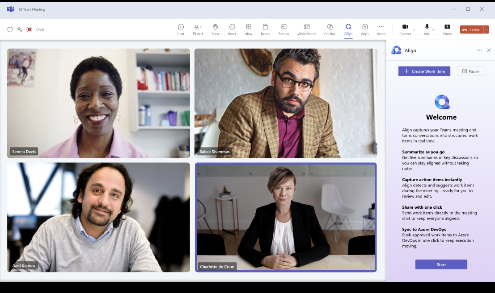
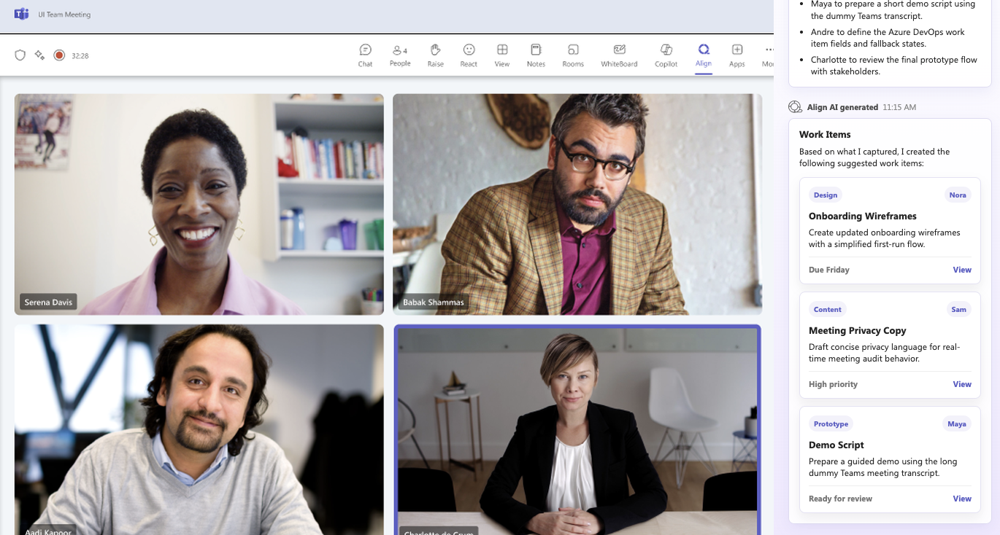
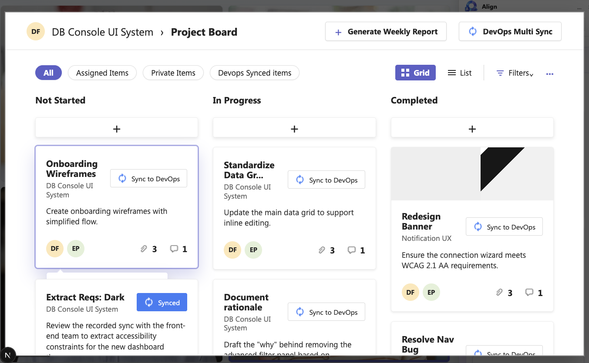

# Microsoft_Teams_AIFeature

## Description

This project showcases a prototype for an AI-powered Microsoft Teams meeting extension concept called Align. The extension audits a Teams meeting experience in real time, summarizes key discussion points, extracts action items, and converts selected suggestions into structured work items that can be saved to a project dashboard.

This build focuses on a polished prototype flow rather than a production AI integration. It uses long-form dummy Teams meeting data and curated mock AI outputs to demonstrate the intended user experience: a Teams-style meeting canvas, an Align side panel, automatically sequenced AI-generated messages, work item cards, detailed work item review, and a save-to-project interaction.

The prototype is designed around Microsoft Fluent UI visual patterns where possible, including Segoe UI typography, Teams-inspired toolbar structure, compact work item cards, Fluent-style spacing, accessible button states, and restrained interaction feedback. The primary target is a fixed desktop demonstration canvas with a minimum width of 1200px for use in portfolio, Framer, GitHub, and Vercel presentation contexts.

## Link to Live Demo

[https://microsoft-teams-ai-feature.vercel.app/](https://microsoft-teams-ai-feature.vercel.app/)

## App Screenshots

### Teams meeting with Align



### Generated meeting intelligence



### Align project dashboard



## How to Use the Live Demo

1. Open the [live demo](https://microsoft-teams-ai-feature.vercel.app/) in a desktop-width browser window. The prototype is designed as a fixed 1200px+ Teams-style meeting canvas, so a wider window will show the experience most accurately.
2. Start on the Teams meeting screen and look at the Align panel on the right side. This panel represents the in-meeting AI assistant that listens to the meeting and prepares structured output.
3. Click **Start** in the Align panel. The prototype will begin the simulated audit flow and automatically generate messages in sequence, with short pauses between each one.
4. Watch the generated output move through three layers: a meeting **Summary**, extracted **Action Items**, and suggested **Work Items** that could be saved into the user's Align workspace.
5. In the **Work Items** message, click **View** on any suggested card. This opens a work item detail window above the Teams meeting, with the background dimmed so the review step feels focused.
6. Review the generated work item details, then click **Save to Project**. The button moves through a saving state and then confirms that the work item has been saved successfully.
7. Click **View in Align** in the success message. This opens the Align project dashboard, where the newly saved item appears in the board next to existing project work.
8. Hover over the newly added work item card on the dashboard. It uses a highlighted state and a small context preview to show which item came from the meeting audit flow.

## Tools and Technologies Used

- Confluence design system — visual structure, spacing, card patterns, and interaction polish adapted for the prototype.
- Next.js — app framework, local development server, and production build pipeline.
- React — component-based interface for the Teams canvas, Align panel, staged messages, and dashboard modal.
- TypeScript — typed mock transcript data, audit structures, and UI state.
- CSS3 — fixed-width canvas, grid layout, transitions, keyframe animation, and hover states.
- Segoe UI — bundled Microsoft-style typography.
- Figma — source of truth for detailed UI references and design handoff.
- Git & GitHub — version control and repository hosting.
- Vercel — hosting target for Framer embedding and live demo access.

## Pages

/ — Prototype: Microsoft Teams-style meeting background with four meeting participants, a highlighted Align toolbar entry, and the Align side panel.

The prototype currently includes:

Welcome state — Align introduction screen with Start control.
Generated message flow — after Start, AI messages appear in sequence with animated timing.
Summary — key discussion points extracted from the mock meeting transcript.
Action Items — follow-up items with owners and project context.
Work Items — dashboard-ready suggested work items displayed as cards.
Work Item Detail — modal view opened from each work item card, with metadata, task checklist, attachments, and project actions.
Save to Project — animated saving state, saved confirmation, and success message with a View in Align button for future dashboard navigation.

The audit content is driven by shared mock data and helper logic in `src/lib/`, so the prototype behaves like a connected feature concept rather than a static mockup.

## Responsive Strategy

Built desktop-first for a fixed presentation canvas:

Base (1200px minimum) — fixed-width Teams meeting experience with a right-side Align panel and full meeting background.
Large desktop — the canvas remains stable so the prototype can be presented consistently in portfolio, Framer, and Vercel contexts.
Narrower browser windows — horizontal overflow is allowed so the 1200px prototype layout does not collapse or distort.

The interface can be adapted into a responsive experience later, but this prototype intentionally prioritizes visual accuracy and controlled presentation fidelity.

## Getting Started

```bash
npm install
npm run dev
```

Build for production:

```bash
npm run build
```

## Project Structure

```text
Microsoft_Teams_AIFeature/
  next.config.mjs        Next.js configuration
  package.json           scripts and dependencies
  pnpm-lock.yaml         dependency lockfile
  tsconfig.json          TypeScript configuration
  src/
    app/
      layout.tsx         app metadata and root layout
      page.tsx           main Teams + Align prototype experience
      globals.css        Segoe UI fonts, Fluent-inspired styling, layout, and animations
      api/audit/route.ts mock audit API endpoint
    lib/
      auditEngine.ts     curated summary, action item, and work item generation
      mockTeamsTranscript.ts long dummy Teams meeting transcript
      types.ts           shared TypeScript data models
  public/
    align-panel/         Align panel icons, references, work item assets, and detail icons
    fonts/segoe-ui/      bundled Segoe UI font files
    teams-background/    Teams toolbar, logo, and meeting control assets
    teams-meeting-photo/ participant meeting images
```
